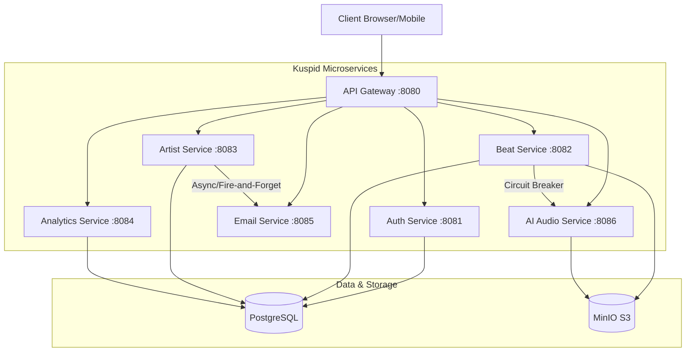

# Kuspid Backend Architecture

## Key Features
- **Logical Independence**: Each service has its own bounded context and schema.
- **Fault Isolation**: Resilience4j circuit breakers prevent cascading failures.
- **Unified Deployment**: Optimized for Render free tier via Supervisord in a single container.
- **Security**: JWT-based authentication validated at the Gateway.
- **AI-Powered**: librosa integration for BPM and Key detection.
